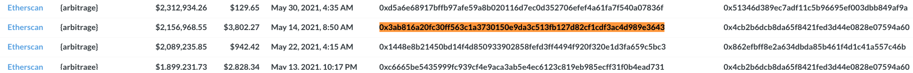
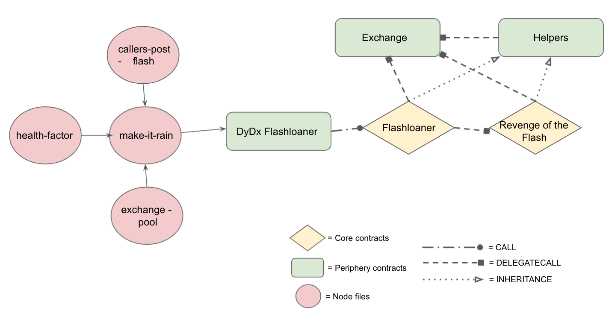
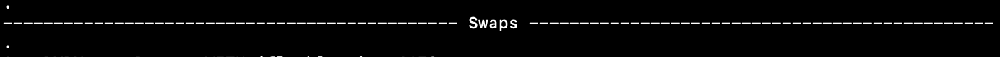
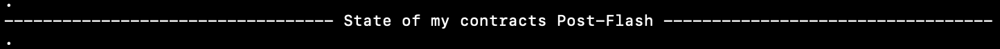
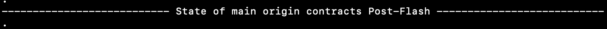

# Flashbots Arbitrage
This project is the recreation of a Flashbots arbitrage transaction made on May 14th, 2021 (pre-London). 

According to the MEV-explore dashboard, it initially had a profit of $2,156,968.55, but after re-doing the transaction, I came up with a different P/L which I back up with on-chain data and Flashbots documentation.
 

## Transaction
Etherscan: https://etherscan.io/tx/0x3ab816a20fc30ff563c1a3730150e9da3c513fb127d82cf1cdf3ac4d989e3643

Tenderly: https://dashboard.tenderly.co/tx/mainnet/0x3ab816a20fc30ff563c1a3730150e9da3c513fb127d82cf1cdf3ac4d989e3643

MEV-Explore Dashboard: 




## Protocols involved
1. DyDx
2. Aave
3. 0x (in original tx)
4. Bancor
5. Curve
6. Sushiswap
7. Uniswap v2
8. Balancer
9. Dodo
10. CRO Protocol (Crypto.com)
11. 1Inch (in original tx)

## Deployment

It's a Hardhat mainnet fork that comes already -in an `.env` file- with an Alchemy endpoint to an Archive node, so for running it:
- Pull the right Docker image with `docker pull dnyrm/flash-tx:0.0.9`.
- Run the container with `docker run -it dnyrm/flash-tx:0.0.9`.


## Structure of the project



| Contract | Type | Description |
| ----- | ----- | -----|
| Flashloaner / flashlogic | Core | Main storage contract |
| RevengeOfTheFlash | Core | Continues the execution of the arbitrage from `Flashloaner` |
| DyDxFlashloaner | Periphery | Borrows WETH from `Solo (dydx)` contract (flashloan) and forwards funds to `Flashloaner` |  
| Exchange | Periphery | Swap functions from protocols and custom-made liquidity pool | 
| Helpers | Periphery | Holds main function that connects `Exchange` with `Core`, among other helper functions |
| make-it-rain | Node | Entry file to contracts through `DyDxFlashloaner` |
| exchange-pool | Node | Creates the `Exchange`'s liquidity pool | 
| health-factor | Node | Sets up `Flashloaner`'s health factor within Aave's liquidity pool to match original caller's (pre-loan) |
| callers-post-flash | Node | Logs the final state of both my contracts and original contracts |

`Flashloaner` is the main contract where the all the state variables are stored. For this reason, the majority of the connections that it makes to other contracts are through `DELEGATECALL` to preserve this centralization of storage for better efficiency. 

`RevengeOfTheFlash` continues the arbitrage from `Flasloaner`. 

`DyDxFlashloaner` is the contract that executes the flashloan from DyDx's `Solo` contract and borrows WETH. It later on forwards the funds and storage of the transaction to `Flashloaner` by a `CALL`.

`Exchange` is where all the functions that swap between protocols are located. It also stores the funds from the liquidity pool created by `exchange-pool`, and the function that withdraws them.

`Helpers` connects the `Core` contracts with the `Exchange` through its main function `swapToExchange()` by `DELEGATECALL`:

```js
function swapToExchange(
    bytes memory _encodedData, 
    string memory _swapDesc, 
    address _exchange
) internal returns(uint tradedAmount) {

    (bool success, bytes memory returnData) = _exchange.delegatecall(_encodedData);
    if (success && returnData.length > 0) {
        (tradedAmount) = abi.decode(returnData, (uint256));
    } else if (!success) {
        console.log(_getRevertMsg(returnData), '--', _swapDesc, 'failed');
        revert();
    }
    
}
```

Contains as well other helpers functions, like for decoding the response bytes data in case of an error into a readable string. 

`make-it-rain` is the main entry file to the contracts. Deployments and the calculation of P/L happens here. 

`exchange-pool` creates the liquidity pool from where `Core` extracts funds, replacing the 0x trades of the original transaction (more details below). 

`health-factor` matches the health factor and debt state of `Flashloaner` within Aave's main liquidity pool with that of the original caller (pre-flashloan). So `Flashloaner` starts the transaction in the same conditions as that of the original caller.

`callers-post-flash` logs the state of my contracts post my transaction, and the original contract's post the original transaction.


## Swaps



Unless writen otherwise (like "Borrow WETH..." or "Withdraw USDC"), the format of each swap on the logs is: 

```js
6.- BANCOR --- ETH:  224
7.- CURVE --- TUSD:  893866
```

| Operation # | Protocol | Coin/Token received | Amount received |
| ----- | ----- | ----- | ----- |


## Explanation of `exchange-pool`

This file replaces six 0x swaps from the original transaction for a custom-made liquidity pool within the `Exchange` contract:

- `Swap 11,184.9175 USDC For 1,506.932141071984328329 BNT On 0x Protocol` (#4)
- `Swap 882,693.24684888583010072 TUSD For 224.817255779374783216 WETH On 0x Protocol` (#9)
- `Swap 984,272.740048 USDC For 19.30930945 WBTC On 0x Protocol` (#12)
- `Swap 19.66568451 WBTC For 253.071556591057205072 WETH On 0x Protocol` (#17)
- `Swap 938,699.561732 USDT For 239.890714288415882321 WETH On 0x Protocol` (#20)
- `Swap 905,978.317545 USDC For 231.15052891491875094 WETH On 0x Protocol` (#26)

The reason of this is because the original transaction uses an off-chain relayer for these trades, which swaps are performed through the 0x SRA API v2, and, due to the off-chain nature of these trades, a mainnet fork with an old pinned block cannot be deterministic since it can't access off-chain state from the past. 


## Pre-flashloan state


This section compares the health factor and debt state within Aave's main liquidity pool between `Flashloaner` and the original caller contract. As you can see on the logs, both are almost identical so they're entering the flashloan with the same conditions.

`Flashloaner`'s set up is made by `health-factor.js`. 


## Post-flashloan state





Compares between my contracts -after my transaction- and the contracts from the orginal transaction (post original transaction):

- Balances on each ERC20 token transacted with (USDC, aUSDC, USDT, aUSDT, WETH, aWETH, WBTC, TUSD, BNT) and ETH. 
- Health Factor.
- Collateral in pool (in ETH).
- Debt (in ETH).
- Borrowing power (in ETH).
- Among other values. 

As you can see by the logs in both sections, the balances, state, and numbers of both groups of contracts are almost the same, so they finished the transaction with the same conditions (with the exception of the 5493 ETH on `Signer` (my contracts) which come from the default 10,000 ETH that all accounts from the local hardhat network come with).


## P/L

According to the MEV-Explore dashboard, this transaction had a profit of $2,156,968.55, but there are certain parameters that need to be taken into account. MEV-Inspect (Flashbot's tool for collecting and clasifying data):

- Doesn't analyze Dodo, CRO Protocol, and 1Inch, which were used during this arbitrage. 
    - TL;DR about 1Inch usage on the original transaction: all swaps occur on a `JUMP` call to `OneInchExchange` (`0x111111125434b319222cdbf8c261674adb56f3ae`).

From original tx:

```js
{
  "[FUNCTION]": "getOneInchAddress",
  "[OPCODE]": "JUMP",
  "contract": {
    "address": "0xc639e779ebedcc9394dd534a3cf8a2d164f1ee97"
  },
  "caller": {
    "address": "0x691d4172331a11912c6d0e6d1a002e3d7ced6a66",
    "balance": "999974880549365"
  },
  "[INPUT]": "0x",
  "output": {
    "0": *** "0x111111125434b319222cdbf8c261674adb56f3ae" ***
  }
}
```

```js
{
  "[FUNCTION]": "oneInchSwap",
  "[OPCODE]": "JUMP",
  "contract": {
    "address": "0xc639e779ebedcc9394dd534a3cf8a2d164f1ee97"
  },
  "caller": {
    "address": "0x691d4172331a11912c6d0e6d1a002e3d7ced6a66",
    "balance": "999974880549365"
  },
  "output": {
    "z": "4505879348962757498457" ---> output shown at the end of the tx on Etherscan on 1Inch swap
  }
}
```

From Flashbots documentation:

```js
// Addresses which should be ignored when used as the target of a transaction
pub static FILTER: Lazy<HashSet<Address>> = Lazy::new(|| {
 let mut set = HashSet::new();
 // 1inch
 set.insert(parse_address("0x11111254369792b2ca5d084ab5eea397ca8fa48b"));
 // 1inch v2
 set.insert(parse_address("0x111111125434b319222cdbf8c261674adb56f3ae"));
 ...
```

So, due to the facts that these protocols are not included in the calculation of the sender's profit on MEV-Inspect and the correlation of on-chain data between my contracts and the original ones pre and post-flashloan, I can affirm that the P/L that this transaction got was : 

```js
****** TOTAL GROSS PROFITS in USDC (signer) ****** :  2627.149029
****** TOTAL NET PROFITS in ETH (original signer) after GAS fees ****** :  -0.9583047320000002
****** Marginal variance HEALTH FACTOR ****** :  -0.07771240532223578
```

This transaction represented a loss of almost 1 ETH to the original caller and a decrease 0.07 on their health factor on Aave's main liqudity pool. 

I also performed the calculations of the `Gas` fees of this recreation, but they're not the same as that of the original transaction since the logic on the latter is more complex than on the recreation.

It's worth noticing that some of the original contracts that were used here are `InstaAccounts` that could have been later used on an alternative purpose which could have influenced the P/L of the transaction post-mortem. Nonetheless, this is just a theory that wasn't proven nor denied since it's out of the scope of this project.


## Security 

Minimal security through the usage of Open Zeppelin's `Ownable` contract -and some custom-made modifications-, on the entry functions of each of my contracts. Further security must have been implented due to the high usage of low-level calls like `DELEGATECALL` and `CALL`.


